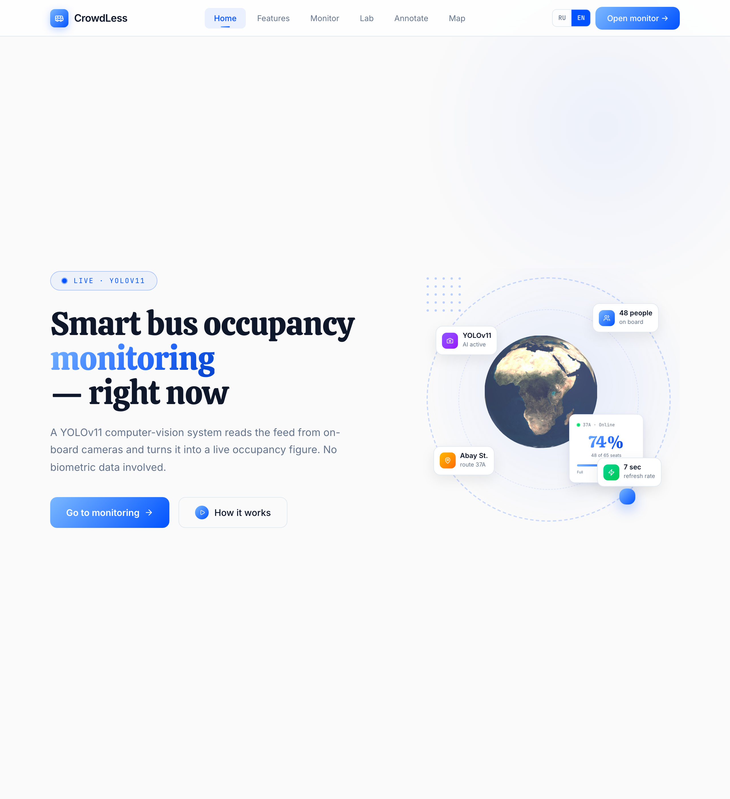
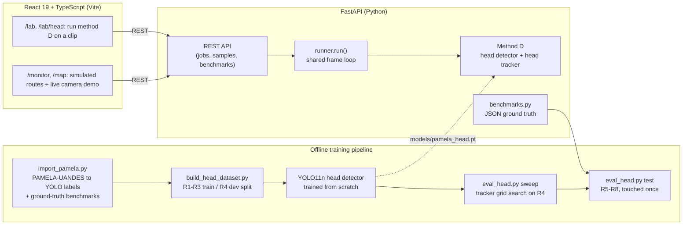
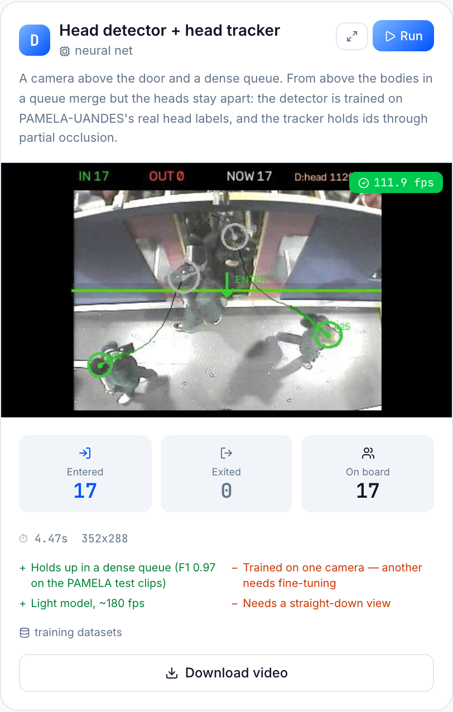
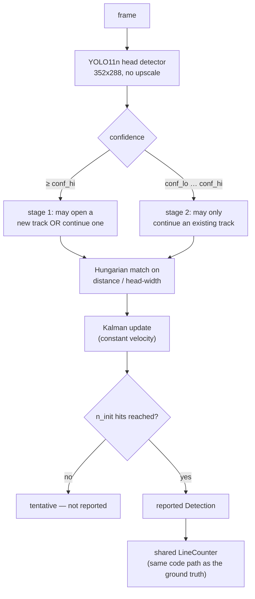
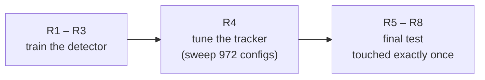
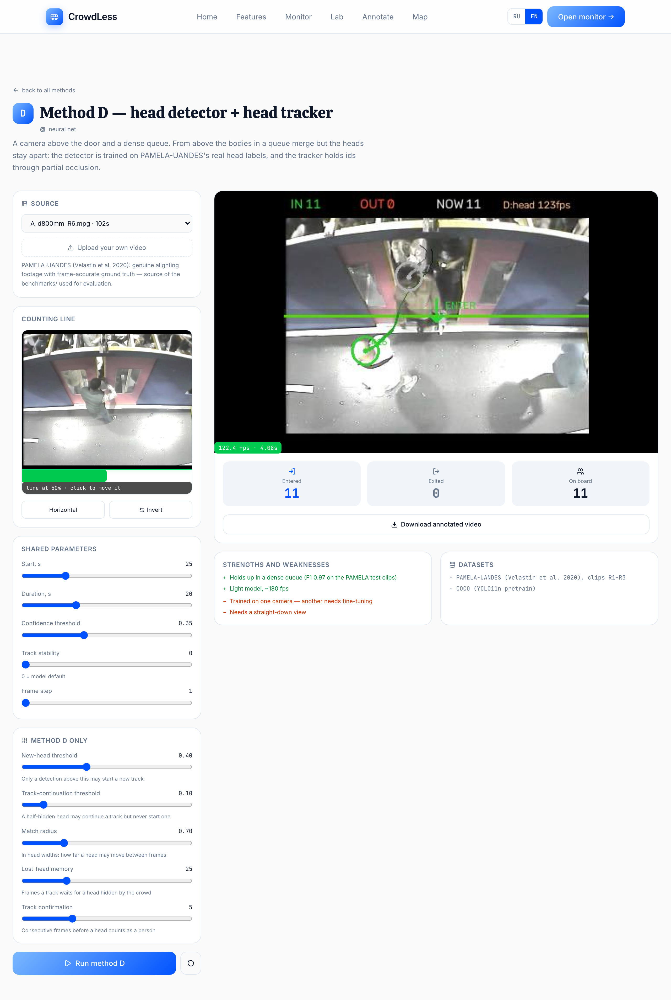

# CrowdLess

**Computer-vision passenger counting for a dense doorway queue: a head detector trained on real annotated ground truth, a tracker built for partial occlusion, and an evaluation protocol with a held-out test set that was touched exactly once.**

<p align="center">
  <b>Live demo (frontend only): TODO(owner)</b>. The detection backend is not hosted; see the demo video: <a href="https://youtu.be/KVGqaX-Dgsg">https://youtu.be/KVGqaX-Dgsg</a>
  &nbsp;·&nbsp;
  <a href="#results">Results</a>
  &nbsp;·&nbsp;
  <a href="#quick-start">Run it locally</a>
</p>

<p align="center">
  <a href="https://www.youtube.com/watch?v=KVGqaX-Dgsg">
    
  </a>
  <br>
  <sub>Watch the demo video on YouTube</sub>
</p>

<p align="center">
  
</p>

<!-- TODO(owner): add a short demo GIF or video link. `python -m backend.training.make_hook` renders a stock-YOLO vs method-D comparison clip (see "Comparison clip" below). -->

CrowdLess started as an operational question, *how full is this bus right now?*, and turned into a small, honestly measured project on **counting people crossing a doorway when they never stop overlapping**. A stock "YOLO + tracker" pipeline collapses in that scenario; this repository documents what was tried, what failed, and the approach that held up under a proper train / dev / test split.

**Headline result** (held-out PAMELA-UANDES test clips R5-R8, 270 true entries, touched once): event F1 **0.972**, IN mean absolute error **0.57** entries per clip. Full table, protocol and an ablation showing how much of that comes from the detector versus the tracker are in [Results](#results).

## Features

- **Method D counter.** YOLO11n head detector plus a custom Kalman head tracker feeding a virtual counting line (IN / OUT / current occupancy).
- **Lab** (`/lab`, `/lab/head`). Run the counter on a bundled clip or an uploaded video, place the counting line, tune the five tracker parameters (schema-driven controls), and download the annotated video.
- **Monitor** (`/monitor`) and **Map** (`/map`). Route planner and bus map for a simulated Kyzylorda (Kazakhstan) network. Bus positions and starting occupancy are **simulated**, not live GPS. Each of six per-bus door cameras replays real PAMELA-UANDES footage through method D (needs the local dataset, see [Data](#data)).
- **Evaluation tooling** (`backend/training/`). Dataset import, train/dev split, tracker grid search on the dev clips, a one-shot test run, and a detector-vs-tracker ablation.
- **Bilingual UI** (Russian / English) through a small React context (`src/i18n/`); the backend localises API-authored copy via a `lang` query parameter.
- **Runs locally.** Dockerfiles and a legacy Azure manifest are kept as reference (see [Deployment](#deployment)).

## Architecture



- **Backend**: a single FastAPI process (`backend/main.py`) exposes method D, the sample clips and the benchmark store. A one-worker thread pool serialises jobs so reported frame rates are not distorted by concurrent runs.
- **Frontend**: React 19 SPA. `/lab` and `/lab/head` share one state hook (`useLabSource`) for source, counting line and parameters.
- **Training pipeline**: standalone scripts that import PAMELA-UANDES's annotations, build the detector's training set, and tune/test the tracker with a protocol designed to make test-set overfitting visible.

## Tech stack

- **Frontend**: React 19, TypeScript, Vite, Tailwind CSS v4, Framer Motion, react-router-dom, React Query, Google Maps (`@react-google-maps/api`), three.js / react-three-fiber + drei (landing-page globe).
- **Backend**: FastAPI, Uvicorn, OpenCV, Ultralytics (YOLO11), PyTorch (CPU, CUDA or Apple-Silicon MPS auto-detected), `lap` (Hungarian assignment for the tracker).
- **Quality**: pytest, ruff, ESLint, GitHub Actions.

## Quick start

Prerequisites: Python 3.11+ and Node.js 20.19+ / 22.12+ (the Vite 8 requirement). Verified with Python 3.11.7 and Node 26.8.1.

```bash
# 1. Backend  (http://localhost:8000)
python3 -m venv .venv && source .venv/bin/activate
pip install -r backend/requirements.txt
uvicorn backend.main:app --port 8000
curl localhost:8000/health        # -> {"ok":true,"live_videos":...,"samples":...,"methods":["head"]}

# 2. Frontend, in a second terminal  (http://localhost:5173)
npm install
cp .env.example .env              # optional, see Configuration
npm run dev
```

The fine-tuned detector (`models/pamela_head.pt`, ~5 MB) is committed, so no training run and no weight download is needed. First start is slow (importing PyTorch, up to ~30 s). With no `test_data/` the sample picker is empty: use the **upload** option in `/lab`, or drop your own `.mp4` / `.mov` clips into `test_data/`.

Smoke test of the whole pipeline without the UI (this is how the quick start was verified, with a 12 s PAMELA-UANDES clip):

```bash
curl -s -X POST "localhost:8000/upload?line_ratio=0.5&max_seconds=12" -F "file=@your_clip.mp4"   # -> {"job_id": "...", "method": "head"}
curl -s localhost:8000/job/<job_id>                                                              # status, in_count, out_count, fps
```

### Data

`test_data/` is **not** in the repository (see `.gitignore`). It holds the PAMELA-UANDES dataset (registered research use only, see [Dataset citation](#dataset-citation-and-license)) and any sample clips. Reproducing the training pipeline needs PAMELA-UANDES itself: register at [videodatasets.org/PAMELA-UANDES](https://videodatasets.org/PAMELA-UANDES/whole_data.html) and extract it under `test_data/pamela-uandes/` (the exact expected layout is in `backend/training/import_pamela.py`).

## Configuration

All variables are optional. Vite inlines `VITE_*` values into the browser bundle at build time, so never put a secret in them. Copy `.env.example` to `.env`.

| Variable | Used by | Purpose | Default |
|---|---|---|---|
| `VITE_API_URL` | frontend (`src/services/counters.ts`, `src/services/api.ts`) | Base URL of the FastAPI backend. For a deployed build, set it to the backend's public URL. | `http://localhost:8000` for the lab and monitor; the legacy `/buses` mock in `api.ts` is used when unset |
| `VITE_GOOGLE_MAPS_API_KEY` | frontend (`BusMap.tsx`, `UserPage.tsx`) | Google Maps JavaScript API key for the map views. Public by design, so restrict it by HTTP referrer. | unset: the map shows an "add a key" hint |
| `PORT` | backend `Dockerfile.backend` | Port uvicorn binds to inside the container. | `8000` |
| `YOLO_CONFIG_DIR` | backend `Dockerfile.backend` | Writable Ultralytics config directory in the container. | `/tmp/ultralytics` |
| `CORS_ORIGINS` | backend `main.py` | Comma-separated browser origins allowed to call the API, e.g. `https://my-frontend.example.com`. | unset: any origin (`*`) |

The backend reads no other environment variables. CORS is open (`*`) unless `CORS_ORIGINS` is set, and there is no authentication, which is fine for a demo and not for production.

## Background: why a dense queue breaks the obvious approach

Automatic Passenger Counting (APC) is a mature commercial category — vendors like Hella Aglaia, Iris, Xovis and DILAX sell door-mounted sensors built on infrared, stereo depth or a proprietary vision stack. The obvious DIY approach — point an off-the-shelf person detector at the doorway camera, track the boxes, count line crossings — is what most tutorials online show, and it is what this project's own earlier iterations tried first: a stock YOLO + ByteTrack pipeline, a top-down pose model anchored to the shoulders, and classical background subtraction. All three were measured honestly against hand-annotated ground truth, and all three fell apart the moment the footage stopped being "one person walks through, alone" and became a **continuous, shoulder-to-shoulder boarding queue** — the realistic case, and the one every commercial APC system actually has to handle.

The diagnosis was consistent across all three approaches: from directly overhead, bodies in a queue visually merge into one mass. A whole-body detector either fuses two people into one box, or a background-subtraction blob fuses two people into one contour — either way, the count silently caps out at "how many separate masses do I see", which in a queue is usually 1.

The fix implemented here is method **D**: don't detect the body, detect the **head** — the part of a person that stays visually separate even when shoulders and torsos overlap — and pair it with a tracker designed around how a head actually moves and disappears in a crowd, not a generic multi-object tracker built for cars or spaced-out pedestrians. This is also what the literature converges on: the original PAMELA-UANDES paper (Velastin et al., 2020) built its own baseline around a head detector, and HeadHunter-T (Sundararaman et al., CVPR 2021) shows the same principle at CVPR-paper scale — in one of its own examples, a head detector finds 36 of 37 people in a crowd where a body detector finds 23.

## Method D: head detector + head tracker

<p align="center">
  
</p>

*Four people simultaneously in frame, overlapping at the shoulders — each one still gets its own tracked head and its own trail. This is the exact scene that breaks a body-box tracker.*

### The detector (`backend/counters/method_head.py`)

A **YOLO11n** detector trained from scratch on PAMELA-UANDES's real, hand-annotated head boxes (not a distilled/pseudo-labelled set — see [Data and protocol](#data-and-the-train--dev--test-protocol)). Frames are kept at their native 352×288: upscaling adds pixels, not information, and a head at this camera distance is already only ~32px wide.

### The tracker (`HeadTracker` in the same file)

A generic multi-object tracker (ByteTrack, DeepSORT, BoT-SORT) is built around box IoU and a body-sized motion budget. Neither assumption holds for a small, fast-moving head, so this project implements its own:

- **Constant-velocity Kalman filter** per track — predicts where a head will be next frame and smooths measurement jitter, rather than trusting the raw detection centre.
- **Association by distance in head-widths, not IoU.** A ~32px head can move a large fraction of its own size between frames — exactly when a fast walker's box stops overlapping frame-to-frame under IoU matching. Distance normalised by head size stays stable through that.
- **Two-stage matching, the ByteTrack idea, applied to heads:** a confident detection may open a brand-new track *or* continue an existing one; a low-confidence detection — a head half-hidden behind a taller neighbour — may only **continue** a track, never start one. This is the single change that turned "shoulder-height occlusion" from a source of phantom double-counts into a track that simply survives.
- **Coasting through short occlusions.** An unmatched track keeps extrapolating (with decaying velocity) for up to `max_lost` frames before it is dropped, so a person briefly swallowed by the queue keeps their id and isn't recounted under a new one.
- **Track confirmation (`n_init`).** A track isn't reported — and can't be counted — until it has `n_init` consecutive hits, which filters out single-frame detector noise.



Output is the tracker's filtered head centre with a stable id, fed into the project's shared `CountLine`/`LineCounter` — the exact same code path used to turn PAMELA-UANDES's raw annotated tracks into the ground-truth numbers below, so the comparison isn't measuring two different pieces of counting logic.

## Data and the train / dev / test protocol

**PAMELA-UANDES** (Velastin et al. 2020, *Sensors* 20(21):6251) is a research dataset of overhead doorway footage with every person's **head hand-annotated on every frame**, with a persistent id, across 15 videos of people boarding and alighting a train. That is real, dense ground truth — no distillation, no pseudo-labels.

The critical design decision is the split, because a tracker has knobs, and tuning those knobs on the same clips you report accuracy on produces a number that means nothing:



- **R1–R3** → the detector's only training data (`backend/training/build_head_dataset.py`).
- **R4** → held out from training; used to grid-search the tracker's five parameters (`backend/training/eval_head.py sweep`, 972 configurations scored by event F1).
- **R5–R8** → touched exactly once, after every other decision was already made (`eval_head.py test`).

Scoring follows the same convention as the PAMELA-UANDES paper's own Table 6: a predicted crossing is a true positive only if it matches a ground-truth crossing in the **same direction**, within **±1 second**; precision/recall/F1/accuracy (`accuracy = TP/(TP+FP+FN)`) are computed on those matches, not on raw counts.

## Results

<p align="center">
  
</p>

Detector, on the held-out dev clip (R4, never trained on): **precision 0.98, recall 0.96, mAP50 0.991**.

End-to-end, on the test clips (R5–R8, 270 true entries, touched once):

| Metric | Value |
|---|---|
| IN mean absolute error | **0.57** entries/clip |
| OUT mean absolute error | 0.29 entries/clip |
| Event precision | 0.968 |
| Event recall | 0.975 |
| Event F1 | **0.972** |
| Event accuracy (TP / (TP+FP+FN)) | 0.945 |
| Inference speed | ~110–190 fps (Apple-Silicon MPS, no dedicated GPU) |

For scale: this project's earlier body-detector and background-subtraction methods, measured on the identical clips with the identical scoring, landed at **IN MAE 10.6–24** — an order of magnitude worse. (Those methods, and the code that produced that number, were dropped from the running app once D superseded them; see git history.)

<!-- TODO(owner): `python -m backend.training.evaluate --suite --quiet` re-run during the cleanup printed `head 8 1.38 +0.12 50% 75%` (CPU/MPS torch 2.14, ultralytics 8.4.174), not the 1.12 / -0.12 / 62% / 75% shown below. The R5-R8 table above it reproduced exactly. Re-measure and update this block, or state the environment it was measured in. -->
Across all 8 benchmark segments this repository ships (including the older single fisheye clip from a different camera, see [Limitations](#limitations)):

```text
$ python -m backend.training.evaluate --suite
method    segments  MAE(in)    bias   exact  within1
head             8     1.12   -0.12     62%      75%
```

## Ablation: what the custom tracker is actually buying

It would be easy to claim the hand-built `HeadTracker` is the reason this works. Measured honestly, it mostly isn't:

```text
$ python -m backend.training.eval_head trackers
bytetrack.yaml   IN MAE 0.71  OUT MAE 0.43  F1 0.972  acc 0.945
botsort.yaml     IN MAE 0.71  OUT MAE 0.43  F1 0.972  acc 0.945
```

The same detector, run under Ultralytics' stock ByteTrack or BoT-SORT instead of the custom tracker, gets the **same F1 (0.972)** and only a slightly worse count error (0.71 vs. 0.57 MAE). **Almost the entire improvement over the old methods comes from training a detector on real head labels — not from the tracker.** The custom tracker is a genuine, measured improvement, just a modest one on top of a much larger effect; presenting it as the whole story would be a materially misleading claim, so it isn't presented that way here.

## Limitations

Stated plainly, because a portfolio project is more credible for saying this than for omitting it:

- **The detector does not transfer across cameras.** Run against the STONKAM fisheye bus-door benchmark (a different camera entirely: colour, 1920x1080, a different mounting height and lens), method D counts **0 of 5** true entries. Frame-by-frame inspection shows the detector *does* fire on real heads (confidence up to ~0.8) but flickers between roughly 0.1 and 0.8 on the same head across consecutive frames, so it never sustains `n_init` (5) confident hits in a row and no track is ever confirmed. This is a textbook domain-gap symptom, not a tracker bug: fixing it needs head labels from the target camera and a re-run of the same train/dev/test protocol, not a threshold tweak.
- **Only one dense-queue camera placement was used for training.** R1-R3 is PAMELA-UANDES's own camera at one height and angle; the detector's ceiling is that camera's own visual style.
- **The `--suite` MAE of 1.12** in [Results](#results) is pulled down by one dissimilar STONKAM clip method D was never meant for; the in-domain number is the R5-R8 table above it.
- **Event matching tolerance (+-1 s) can mask small timing errors** that a stricter tolerance would surface. It was chosen to match the original paper's protocol for comparability.
- **Demo shell is simulated.** Bus positions and starting occupancies on `/monitor` and `/map` are generated, not real data; only the per-bus camera counts come from actual detections.
- **Not production-ready.** No authentication, open CORS, an in-memory job store, and uploaded videos are written to temp files that are not cleaned up.
- **The annotation UI was removed from the frontend** (commit `82de596`); the `/benchmarks` and `/sample/{id}/strip` API endpoints remain.
- **Some frontend lint rules are downgraded to warnings** (React Compiler rules from `eslint-plugin-react-hooks` v7; 14 warnings, 0 errors).

## Project structure

```text
backend/
├── main.py                     FastAPI app: jobs, samples, benchmarks, live demo endpoint
├── bench.py                    CLI for a quick run of method D over a video file
├── benchmarks.py               Flat-file (JSON) ground-truth store
├── bus_cams.py                 Per-bus door cameras: real PAMELA clips replayed through method D
├── requirements.txt            Runtime dependencies (requirements-dev.txt: pytest, httpx, ruff)
├── counters/
│   ├── runner.py               Shared frame loop + method D's parameter schema
│   ├── common.py               CountLine, LineCounter, drawing helpers
│   ├── models.py               Lazy YOLO weight loading
│   └── method_head.py          Method D: YOLO11n head detector + HeadTracker
└── training/
    ├── import_pamela.py        PAMELA-UANDES CSVs -> YOLO labels + ground-truth benchmarks
    ├── build_head_dataset.py   R1-R3 train / R4 dev split for the head detector
    ├── eval_head.py            sweep (tune on R4) / test (score on R5-R8) / trackers (ablation)
    ├── evaluate.py             Score the method against every benchmark in benchmarks/
    └── make_hook.py            Split-screen stock YOLO + ByteTrack vs. method D comparison clip

src/                            React + TypeScript SPA
├── pages/                      LandingPage, LabPage, MethodPage, MonitorPage, UserPage (/map)
├── components/                 landing/, lab/ (LinePreview, MethodCard), layout/, map/, ui/
├── hooks/                      useLabSource, useBusSimulation, useBusCamera, ...
├── i18n/                       ru.ts (source of truth) + en.ts
└── services/                   counters.ts (typed API client), routes, mock data

tests/                          pytest suite (29 tests)
models/pamela_head.pt           The fine-tuned detector (tracked, ~5 MB)
benchmarks/                     8 ground-truth segments (tracked JSON): 7 from PAMELA-UANDES, 1 legacy
docs/screenshots/               Images used in this README
Dockerfile.backend, Dockerfile.frontend, nginx.conf    Container images (frontend image/nginx.conf are the self-hosted option)
aci-deploy.yaml                 Legacy Azure Container Instances manifest (no longer used)
docs/DEPLOY.md                  How to run it (local run, legacy Azure files)
.github/workflows/ci.yml        Lint + tests for backend and frontend
```

## Testing

```bash
pip install -r backend/requirements.txt -r backend/requirements-dev.txt
pytest -q          # 29 tests, no weights or video needed
ruff check .       # Python lint
npm run lint       # frontend lint (0 errors, 14 warnings)
npm run build      # type-check + production build
```

What the tests cover: counting-line logic (dead zone, direction, `invert`, cooldown, minimum track age), `HeadTracker` (confirmation, two-stage matching, coasting through occlusion, id stability), the evaluation metrics (`match_events`, precision / recall / F1 / accuracy, reproducing the R5-R8 table above), consistency of the shipped benchmark JSON files (including the 270 true entries quoted in Results), and the API (health, parameter schema and sanitising, benchmark CRUD). CI (`.github/workflows/ci.yml`) runs the same checks. The detector's accuracy numbers themselves need the PAMELA-UANDES dataset and are reproduced by the commands below, not by CI.

## Reproducing the pipeline from scratch

```bash
# 1. Build the detector's training set (R1-R3 train / R4 dev) and the
#    ground-truth benchmarks (R5-R8, from PAMELA-UANDES's own annotated tracks)
python -m backend.training.build_head_dataset
python -m backend.training.import_pamela --skip-train   # writes benchmarks/*.json

# 2. Train the head detector from scratch (downloads the ~15 MB yolo11n.pt base weights)
python3 -c "
from ultralytics import YOLO
YOLO('yolo11n.pt').train(data='datasets/pamela_head/data.yaml', imgsz=384,
                          epochs=30, batch=32, project='runs/head', name='y11n_384')
"
cp runs/head/y11n_384/weights/best.pt models/pamela_head.pt

# 3. Tune the tracker on R4 only (writes runs/head_best.json), then test once on R5-R8
python -m backend.training.eval_head sweep
python -m backend.training.eval_head test

# 4. Honest ablation: how much of the result is the detector vs. the tracker
python -m backend.training.eval_head trackers

# 5. Score against every saved benchmark segment
python -m backend.training.evaluate --suite
```

### Comparison clip for a demo video

`backend/training/make_hook.py` renders a split-screen comparison on one annotated clip: a stock COCO YOLOv8n + ByteTrack counter on the left, method D on the right, both reading the same counting line, with a running ground-truth tally from the dataset's own annotations.

```bash
# Rank every benchmark clip first, so the clip you show is representative rather than the best one
python -m backend.training.make_hook --scan --scan-seconds 40 --stock-weights yolov8n.pt

# Render one comparison (--flip swaps which direction counts as IN/OUT)
python -m backend.training.make_hook --bench benchmarks/a-d800mm-r5_0.0-76.0.json \
    --start 14 --seconds 14 --stock-weights yolov8n.pt --flip --out out/hook.mp4
```

The stock detector looks for whole bodies, which a dense overhead doorway hides; on the clip above it counts 1 of 11 people leaving while method D counts 11. The scan shows the same gap on every clip, not just this one. Output goes to `out/` (git-ignored).

## API reference

| Endpoint | Purpose |
|---|---|
| `GET /methods` | Method D's metadata + its parameter schema, localised |
| `GET /models` | Weight-set variants per method (empty today: D ships one calibrated checkpoint) |
| `GET /samples` | Bundled clips with curated start-time / line presets |
| `GET /sample/{id}/thumb` | One JPEG frame, for placing the counting line |
| `GET /sample/{id}/strip` | Decoded frame sequence (used by the removed annotation UI) |
| `POST /upload`, `POST /compare` | Analyse an uploaded video |
| `POST /sample/{id}/run` | Analyse a bundled clip without uploading |
| `GET /job/{id}`, `GET /job/{id}/video` | Poll a running job / download its annotated output |
| `GET\|POST /benchmarks`, `DELETE /benchmarks/{id}` | Ground-truth CRUD |
| `GET /analyze` | Live-demo endpoint cycling through bundled clips (Monitor page) |
| `GET /bus-cam/{slot}` | One step of a per-bus door camera (slot 0-5). Needs the local dataset |
| `GET /health` | Liveness check |

Interactive docs are served by FastAPI at `/docs`.

## Deployment

The live demo is offline: it ran on Azure on a student credit that has run out, and it is not hosted anywhere else. Watch the [demo video](https://youtu.be/KVGqaX-Dgsg) instead, or run it locally (see [Quick start](#quick-start)).

`aci-deploy.yaml`, `Dockerfile.backend`, `Dockerfile.frontend` and `nginx.conf` describe the former Azure Container Instances deployment. They are kept for reference and self-hosting. See [docs/DEPLOY.md](docs/DEPLOY.md).

## Author's role

I designed, built and deployed CrowdLess end to end.

- **Computer vision.** Method D (a YOLO11n head detector trained on PAMELA-UANDES head labels, plus a tracker written for partial occlusion), the train / dev / test protocol with a test set scored once, and the ablation that separates the detector's contribution from the tracker's.
- **Product.** The React + TypeScript frontend (landing page, route planner and Google Maps monitor, per-bus door cameras, the lab) and the FastAPI backend that serves the detector.
- **Delivery.** Docker images, deployment (Azure Container Instances, since taken offline), tests and CI, and the split-screen comparison script used for the demo video.

The dataset and its annotations are the work of Velastin et al. (see the citation below). The detector architecture, tracker baseline and web frameworks come from the open-source libraries listed in the tech stack.

## License

No licence has been declared for this repository's own code yet, so all rights are reserved by default.
<!-- TODO(owner): confirm MIT (or another licence) and add a LICENSE file. -->

### Dataset citation and license

The detector is trained on **PAMELA-UANDES**, which is restricted to registered, non-commercial research use. The raw dataset is not redistributed here. Anyone reproducing the training pipeline must register their own access at [videodatasets.org/PAMELA-UANDES](https://videodatasets.org/PAMELA-UANDES/whole_data.html) and credit the original work:

> Velastin, S. A., Fernández, R., Espinosa, J. E., & Bay, A. (2020). Detecting, Tracking and Counting People Getting On/Off a Metropolitan Train Using a Standard Video Camera. *Sensors*, 20(21), 6251. https://doi.org/10.3390/s20216251
