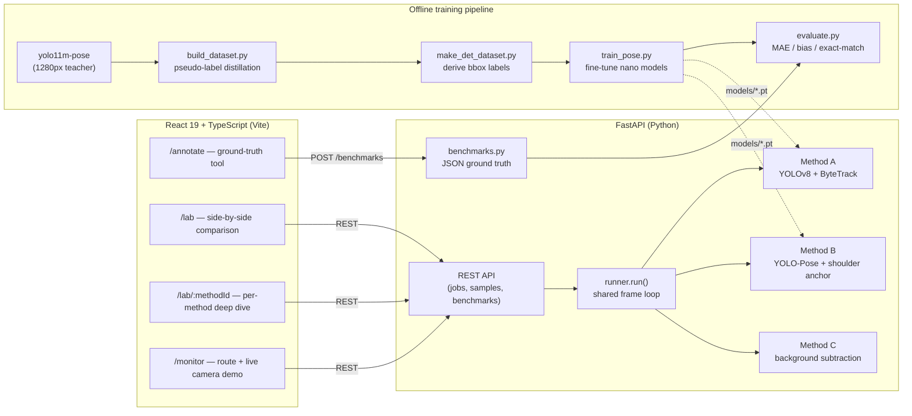
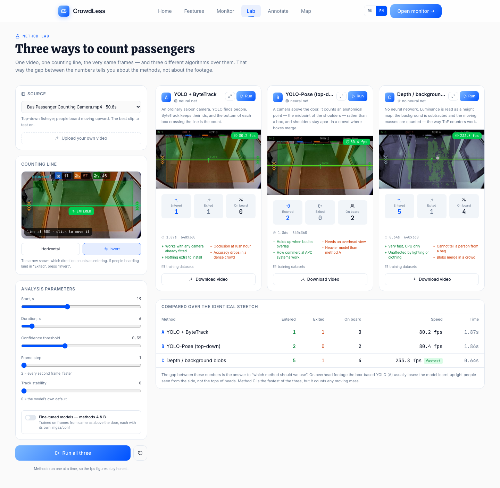
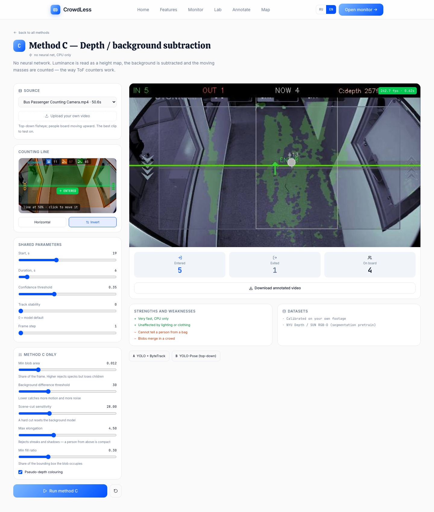
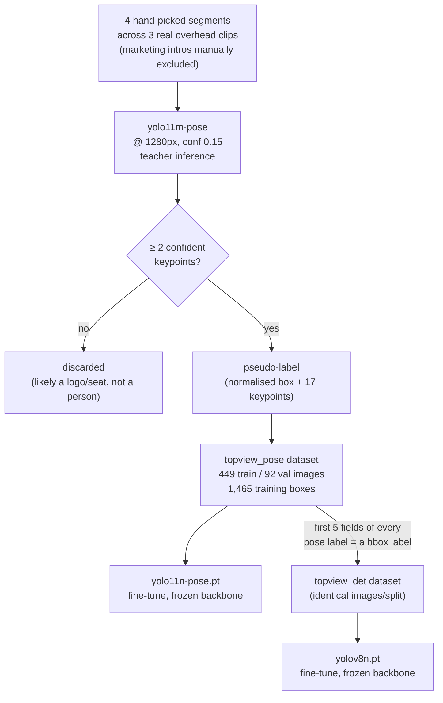
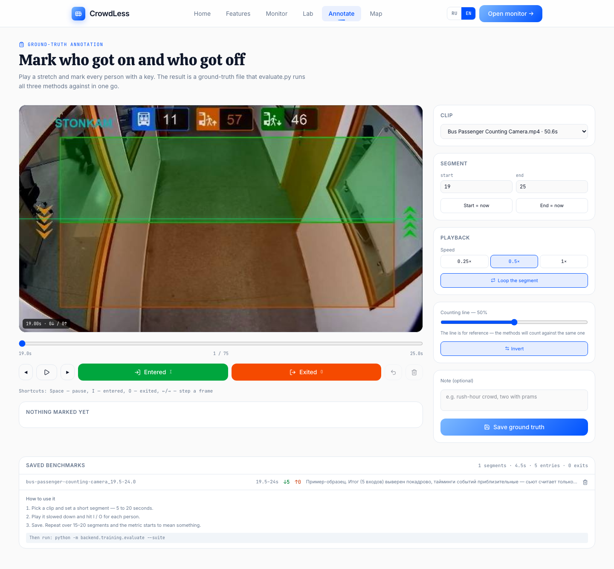
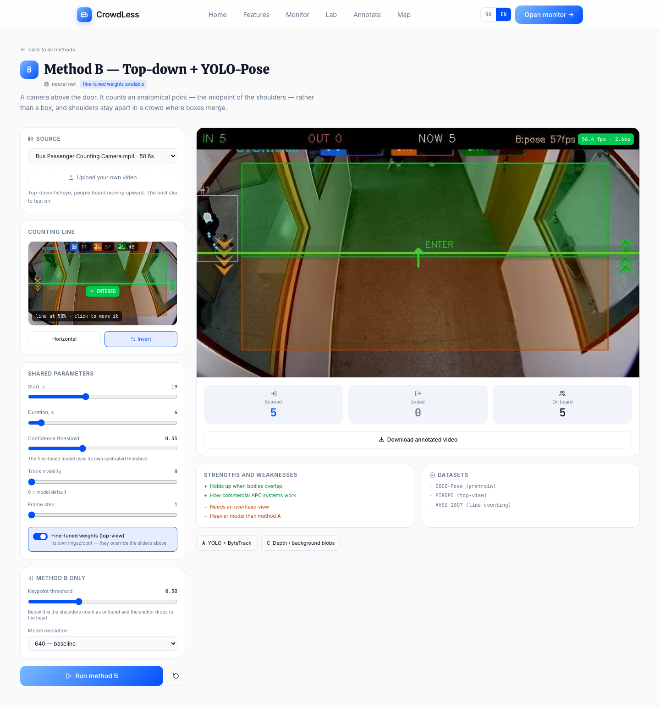
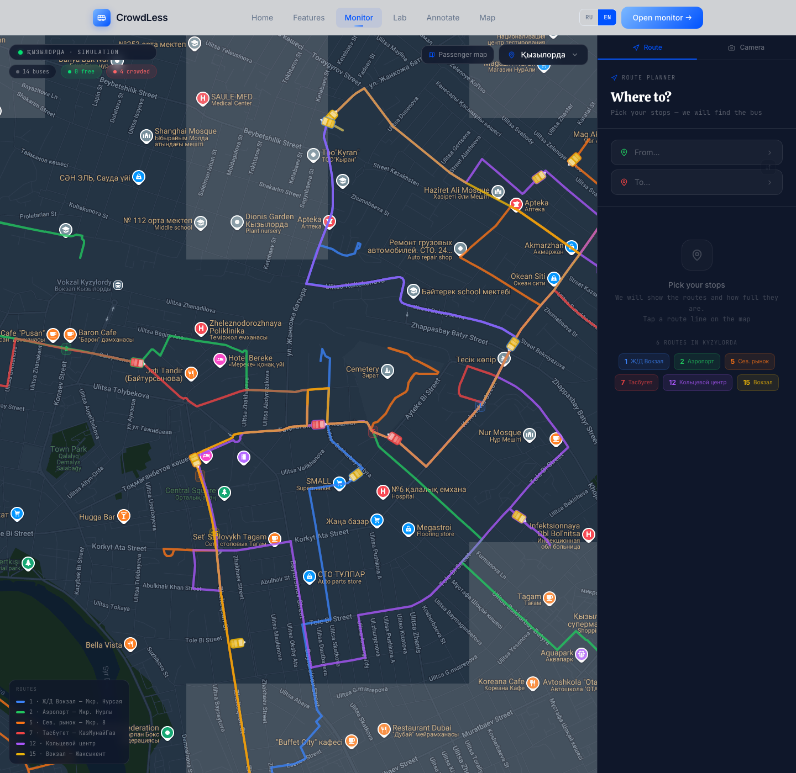

# CrowdLess

**Computer-vision passenger counting for public transit — three competing detection methods, one shared evaluation harness, and a data pipeline to make any of them better.**

CrowdLess started from a simple operational question — *how full is this bus, right now?* — and turned into a small research project on **which computer-vision approach answers that question best from a doorway camera**. Rather than committing to one architecture, the project implements three independent counting methods behind an identical counting core, builds a ground-truth annotation tool to score them honestly, and uses a teacher–student distillation pipeline to close the gap between a generic person detector and a camera that looks straight down at people's heads.

<p align="center">
  
</p>

---

## Table of contents

1. [Motivation](#1-motivation)
2. [System overview](#2-system-overview)
3. [The three counting methods](#3-the-three-counting-methods)
4. [Shared counting core](#4-shared-counting-core)
5. [The fine-tuning pipeline](#5-the-fine-tuning-pipeline)
6. [Evaluation methodology](#6-evaluation-methodology)
7. [Results](#7-results)
8. [Limitations and what would strengthen this](#8-limitations-and-what-would-strengthen-this)
9. [Other surfaces in the app](#9-other-surfaces-in-the-app)
10. [Getting started](#10-getting-started)
11. [Project structure](#11-project-structure)
12. [API reference](#12-api-reference)
13. [Internationalization](#13-internationalization)
14. [Tech stack](#14-tech-stack)
15. [License](#15-license)

---

## 1. Motivation

Automatic Passenger Counting (APC) is a mature commercial category — vendors such as Hella Aglaia, Iris, Xovis and DILAX sell dedicated door-mounted sensors for exactly this problem, usually built on infrared, stereo depth, or a proprietary vision stack. What is much less documented publicly is **the trade-off surface**: for a given camera placement and budget, which class of algorithm should you actually reach for, and why does a generic object detector do so much worse from directly overhead than a promotional video suggests?

CrowdLess treats that as the actual research question instead of assuming the answer. It implements three structurally different ways to turn a doorway video stream into an entry/exit count:

- **A — a stock detector + tracker**, the "just point a YOLO model at it" baseline most people reach for first;
- **B — a pose model anchored to an anatomical landmark**, closer to how industrial top-down APC systems are actually built;
- **C — classical background subtraction**, no neural network at all, representing the ToF/stereo-depth counters that dominate the commercial market.

All three are wired through **one shared counting core** (line-crossing logic, dead-zone debouncing, track-age gating) so that a difference in the numbers reflects a difference in *perception*, not a difference in *bookkeeping*. The project then goes one step further than a static comparison: it builds a small **ground-truth annotation tool**, an **evaluation suite that scores every method by mean absolute error against hand-labelled video segments**, and a **teacher–student distillation pipeline** that turns the weakest method's biggest failure mode — a generic detector trained on upright, side-on pedestrians, evaluated on the tops of people's heads — into training data for a fix.

## 2. System overview



**Backend** — a single FastAPI process (`backend/main.py`) exposes the three methods, the bundled sample clips, and the benchmark store. A one-worker thread pool serializes method execution so that reported frame rates are never distorted by two methods competing for the CPU/GPU at once.

**Frontend** — a React 19 + TypeScript SPA. The comparison lab and every per-method page share one state hook (`useLabSource`) for source selection, the counting line, and common parameters, so the two views cannot drift out of sync with each other.

**Training pipeline** — a standalone, backend-independent set of scripts (`backend/training/`) that build a small top-view training set from the project's own footage, fine-tune the nano-scale student models, and evaluate the result against hand-annotated ground truth.

## 3. The three counting methods

<p align="center">
  
</p>

*The screenshot above is a single, unedited run of all three methods over the identical 6-second window of one clip — no cherry-picking. The pattern it shows (A undercounts, C overcounts before its shape filters and B lands closest) is the running theme of this project, quantified properly in [§7](#7-results).*

| | Method A | Method B | Method C |
|---|---|---|---|
| **Approach** | Object detection + tracking | Pose estimation, anatomical anchor | Background subtraction (no ML) |
| **Model** | `YOLOv8n` + ByteTrack | `YOLO11n-pose` + ByteTrack | none — median-background + contours |
| **Counting point** | Bottom-centre of the bounding box | Shoulder midpoint (falls back to head, then box centre) | Blob centroid (image moments) |
| **Camera assumption** | Side-on / in-cabin | Overhead / above the door | Overhead / above the door |
| **Compute** | GPU-friendly (MPS/CUDA/CPU) | GPU-friendly, heavier than A | CPU only, no GPU needed |
| **Fine-tuned in this project** | ✅ `models/topview_det.pt` | ✅ `models/topview_pose.pt` | — (no learned weights to fine-tune) |

### Method A — YOLOv8 + ByteTrack (`backend/counters/method_bbox.py`)

The commodity approach: `model.track()` from Ultralytics runs YOLOv8n restricted to the `person` class, with ByteTrack maintaining a persistent id per detection across frames. The counting point is **not** the box centre but a point 15% up from the box's bottom edge — chosen to approximate where feet meet the floor and to damp the noise a person's swinging legs add to the box's lower edge. Two counting-point strategies are exposed (`bottom` vs `center`); somewhat counter-intuitively, `bottom` remains the stronger choice even on overhead footage, because the box centre of a person viewed from directly above oscillates as their head-to-shoulder silhouette shifts, roughly doubling the number of line crossings.

### Method B — YOLO-Pose with an anatomical anchor (`backend/counters/method_pose.py`)

This is the method purpose-built for a ceiling-mounted camera — the geometry industrial APC systems actually use. Instead of tracking a whole bounding box (which balloons and merges when people press together), it tracks a single anatomical landmark, chosen by a fallback chain:

1. **Both shoulders** confidently detected → the midpoint of the two shoulder keypoints;
2. **One shoulder** confidently detected → that shoulder alone;
3. **Neither shoulder**, but head keypoints (nose/eyes/ears) are → the mean of the confident head points;
4. **Nothing confident** → fall back to the bounding-box centre.

Under a top-down view, two people's shoulders stay visually separated long after their bounding boxes have merged into one blob — which is exactly the failure mode that sinks Method A in a crowded doorway.

### Method C — Background subtraction (`backend/counters/method_depth.py`)

No neural network at all. Frame luminance is treated as a stand-in for a depth/height map (the same principle a real ToF or stereo passenger counter uses, just without the dedicated sensor): a **median background** is computed once from the analysed segment, and each frame is background-subtracted, morphologically cleaned, and its surviving contours are filtered by two shape gates — **aspect ratio** (people seen from above are compact; shadows and light seams are not) and **fill ratio** (a real blob fills most of its own bounding box). Surviving blobs are handed to a minimal nearest-neighbour tracker.

Two details exist purely because the bundled test footage is vendor promo reels that splice several unrelated shots together, not continuous CCTV:

- **Scene-cut detection** — a hard jump in mean frame difference rebuilds the background model and clears all tracks. Without it, a scene cut paints the *entire new frame* as foreground, and every blob crossing the line during the next second gets miscounted.
- **Background drift** — pixels with no foreground activity slowly blend toward the live scene (`0.98·bg + 0.02·frame`), absorbing slow lighting changes without ever becoming permanent false-positive foreground.

Method C is by a wide margin the fastest of the three (**200–250 fps** vs. **50–80 fps** for the neural methods, on CPU) and is immune to lighting and clothing variation — its weakness is exactly what you'd expect from a method with no notion of "person": it cannot distinguish a passenger from a suitcase, and merges fine in a genuinely dense crowd.

## 4. Shared counting core

All three methods are driven by the same frame loop (`backend/counters/runner.py`) and report through the same primitives (`backend/counters/common.py`), so a difference in the final IN/OUT numbers is attributable to the method, not to three different pieces of counting logic:

- **`CountLine`** — a virtual line with a configurable dead-zone band around it. A track must clear the band on the far side before its "side" is considered to have changed, which stops a person standing near the line from being counted repeatedly as noise nudges them back and forth.
- **`LineCounter`** — turns a side-change into a counted event, gated by a per-track **cooldown** (prevents a single crossing from being registered twice) and a **minimum track age** (`min_age`) that suppresses freshly-spawned, still-unreliable tracks from firing immediately. `min_age` turns out to be one of the more consequential knobs in the whole system — see [§7](#7-results).
- **`CentroidTracker`** — a minimal greedy nearest-neighbour tracker used only by Method C, which has no learned re-identification model of its own.

Every parameter above — plus each method's own knobs — is declared once on the backend (`runner.PARAMS`) with its type, range, and a human-readable hint, and the frontend renders its controls directly from that schema. Adding a new tunable parameter to a method requires touching **only the Python side**; no corresponding frontend change is needed.

<p align="center">
  
</p>

## 5. The fine-tuning pipeline

The headline finding that motivated this whole pipeline: **a COCO-trained detector is measurably worse at seeing people from directly above than from the side**, because COCO's `person` class is dominated by upright pedestrians photographed roughly at eye level. On the project's own overhead footage, a much larger pose model (`yolo11m-pose`, run at 1280px) finds **5.7 people per frame** with **4.3 usable shoulder pairs**; the small model actually deployed for real-time inference (`yolo11n-pose` at 640px) finds only **2.2** and **1.7** respectively — a gap large enough to change the final count outright.

No public top-view dataset closes that gap directly. PIROPO and the AVSS 2007 "people counting" set are the closest public matches to this camera geometry, but both ship boxes or raw counts — never the 17 COCO keypoints Method B's shoulder anchor needs — so neither can fine-tune a pose model as-is. The fix implemented here is **teacher–student distillation on the project's own footage**:



**Dataset construction** (`backend/training/build_dataset.py`) samples every 3rd frame from four segments — STONKAM 25–40s, HPC168 94–118s, and two Hikvision segments (52–61s, 68–92s) — deliberately holding out the STONKAM 19–25s window, which is reserved as the end-to-end evaluation benchmark. The split is by **time, not at random**: neighbouring frames are near-duplicates, and a random split would leak validation frames one step away from a training frame. A teacher detection is kept only if at least two of its 17 keypoints are confidently visible; boxes with zero keypoint support are treated as the teacher latching onto background texture (a logo, a seat) and dropped rather than taught to the student. Rotation (±30°) and both flip axes are weighted heavily in training augmentation for a reason specific to this camera geometry: **a ceiling-mounted camera has no canonical "up"**, so the augmentation is standing in for viewpoint diversity the small dataset doesn't have on its own.

**Method A's training set is derived from Method B's**, not built separately: a YOLO-pose label row is `class cx cy w h ⟨17×(x,y,v)⟩`, and its first five fields *are* a YOLO-detection label row. `make_det_dataset.py` exploits that directly (symlinking the images, stripping the label files down to the box fields), so both fine-tunes train and validate on **exactly the same images and the exact same split** — the fairest possible basis for comparing them afterwards.

| | Method B (`yolo11n-pose`) | Method A (`yolov8n`) |
|---|---|---|
| Base weights | COCO-pretrained, backbone frozen (first 6 layers) | COCO-pretrained, backbone frozen (first 10 layers) |
| Train / val images | 449 / 92 | 449 / 92 (identical split) |
| Train-set boxes | 1,465 | 1,465 |
| Train imgsz | 640 | 512 |
| Deployment imgsz | 512 | 512 |
| Optimizer | AdamW, `lr0=0.002`, 3 warm-up epochs | same |
| Epochs run | 26 (of 60 configured) | 30 |
| Best-epoch box metrics | mAP50 **0.443**, precision 0.542, recall 0.465 (epoch 11) | mAP50 **0.520**, precision 0.814, recall 0.450 (final epoch) |

Both fine-tunes are deployed at their own, separately-calibrated inference settings (`FINETUNES` in `backend/main.py`) — running a 512-trained checkpoint at the baseline's 640px/0.30-confidence defaults was an early mistake that produced roughly ten times too many boxes per frame and looked, misleadingly, like a broken model rather than a mismatched inference config.

## 6. Evaluation methodology

A single "does the demo look convincing" run can make any method look right by luck. CrowdLess instead ships a small **ground-truth annotation tool** and scores every method against it with a proper error metric.

<p align="center">
  
</p>

The `/annotate` page decodes a chosen segment into a frame-accurate strip (avoiding the seeking imprecision of a native `<video>` element under HTTP range requests), lets an annotator scrub it at up to quarter speed, and mark every entry/exit with a single keystroke (`I` / `O`) at the exact frame it happens. Saving a segment writes a small, human-readable JSON record — deliberately a flat file under `benchmarks/`, not a database, "so a benchmark can be reviewed in a diff and committed alongside the code that is judged by it":

```json
{
  "clip": "Bus Passenger Counting Camera.mp4",
  "start_seconds": 19.5, "end_seconds": 24.0,
  "line_ratio": 0.5, "invert": true,
  "events": [
    { "t": 20.1, "type": "in" }, { "t": 20.9, "type": "in" },
    { "t": 21.5, "type": "in" }, { "t": 22.3, "type": "in" },
    { "t": 23.1, "type": "in" }
  ],
  "in_count": 5, "out_count": 0
}
```

`backend/training/evaluate.py --suite` then replays every saved benchmark segment through every requested method at its deployment settings, and reports — per method, across however many segments exist — **mean absolute error (MAE)** on the entry count, **signed bias** (negative = undercounts), the **exact-match rate**, and the **within-±1 rate**. This is the tool meant to scale past a single clip; the repository currently ships exactly one hand-verified segment as a worked example, and the honest caveat that follows from that is stated plainly in [§8](#8-limitations-and-what-would-strengthen-this) rather than glossed over.

## 7. Results

Two independent fine-tuned-model detail pages, captured live from the running app:

<p align="center">
  
</p>

Output of the actual evaluation command, verbatim, on the one benchmark segment shipped in the repository (STONKAM 19.5–24.0s, ground truth = **5 people entering**, 0 exiting):

```text
$ python -m backend.training.evaluate --suite
method    segments  MAE(in)    bias   exact  within1
bbox             1     4.00   -4.00      0%       0%
pose             1     3.00   -3.00      0%       0%
depth            1     0.00   +0.00    100%     100%

$ python -m backend.training.evaluate --suite --finetuned
method    segments  MAE(in)    bias   exact  within1
bbox             1     1.00   -1.00      0%     100%
pose             1     0.00   +0.00    100%     100%
depth            1     0.00   +0.00    100%     100%
```

**Reading this honestly, in order of confidence:**

- **The detection-density gap is the solid, unfitted finding.** On held-out overhead frames the fine-tuned Method B recovers a usable shoulder anchor on **100%** of its detections, up from **77%** for the COCO baseline (1.7 → 3.0 shoulder pairs per frame) — this number does not depend on any downstream tuning and is the actual mechanism behind everything else.
- **Both fine-tunes point the same direction on the one benchmark that exists**: Method A goes from missing 4 of 5 entries to missing 1; Method B goes from missing 3 of 5 to an exact match. Method C, which has no learned weights to fine-tune, is already exact on this clip.
- **The exact end-to-end numbers above should be read as a demonstration of the harness working, not as a validated accuracy claim** — see [§8](#8-limitations-and-what-would-strengthen-this) for exactly why, stated without hedging.

Training also runs at very different cost for the two fine-tunes: the detection head trained to convergence in **~19 minutes** (30 epochs) versus **~1 hour 55 minutes** for the keypoint head (26 epochs), simply because a keypoint head is a heavier optimization target than a box head for the same amount of data — both on an Apple-Silicon MPS device, no dedicated GPU.

## 8. Limitations and what would strengthen this

Stated plainly, because a portfolio project is more credible for saying this than for omitting it:

- **N = 1 benchmark segment.** The MAE/exact-match table in §7 is computed over exactly one hand-annotated clip. A method landing on the right number on one segment can do so by luck; the annotation tool and the `--suite` evaluator exist specifically to make that luck visible once more segments are added, but only one has been added so far.
- **`min_age = 10`** for the fine-tuned deployment configs was chosen *after* observing a sweep (`min_age ∈ {3, 6, 10, 15}`) on this same benchmark clip — meaning the end-to-end exact-match numbers are, to an unknown extent, fitted to the very clip that certifies them. The detection-density improvement in §7 is immune to this critique (it is measured before any tracking or thresholding); the end-to-end count is not.
- **The training data is three doorways, ~450 images.** The student's ceiling is the teacher's own accuracy, and three camera placements is not enough to claim the fine-tune generalizes to a doorway shaped meaningfully differently from the ones it saw.
- **The bundled `test_data/` clips are vendor marketing reels**, not continuous CCTV footage — most of each file is unusable, several splice multiple unrelated scenes together (hence the scene-cut handling in Method C), and none of it is licensed for redistribution, which is why it is excluded from this repository (see [§10](#10-getting-started)).

The natural next step is exactly what the tooling was built for: annotate 15–20 more segments across more cameras and lighting conditions, and let `evaluate.py --suite` report a number that means something.

## 9. Other surfaces in the app

The counting research sits inside a small product shell — a route planner and a live-camera monitor for a simulated Kyzylorda (Kazakhstan) bus network, included because the counting pipeline needs a plausible product context to be evaluated in, not because route simulation is itself a contribution of this project. Bus positions and route occupancy here are **simulated**, not fed by live GPS.

<p align="center">
  
</p>

## 10. Getting started

### Prerequisites

- Python 3.11+ (developed against 3.14) and Node.js 20+
- ~200 MB disk for auto-downloaded YOLO/COCO base weights (fetched by `ultralytics` on first use)

### Backend

```bash
python3 -m venv .venv
source .venv/bin/activate
pip install -r backend/requirements.txt

uvicorn backend.main:app --reload --port 8000
```

`GET http://localhost:8000/health` should return `{"ok": true, ...}`. The two fine-tuned checkpoints in `models/` are already committed (~12 MB total) — no training run is required to try Methods A/B with their fine-tuned weights.

### Frontend

```bash
npm install
cp .env.example .env   # fill in your own Google Maps key if you want the map view
npm run dev             # http://localhost:5173
```

The counting lab (`/lab`) talks to the backend at a hardcoded `http://localhost:8000` (`src/services/counters.ts`) — keep the backend on that port, or edit the constant.

### Data

`test_data/` is **not** included in this repository — it holds vendor promotional footage (licensing) and the author's own multi-hundred-megabyte screen recordings (size), listed in `.gitignore`. The backend and every UI page work with an empty `test_data/`; to try the lab against real footage, drop your own `.mp4`/`.mov` clips into `test_data/` (or `test_data/quality/`) and they'll appear in the sample picker automatically. To reproduce the fine-tuning pipeline from scratch you will need footage genuinely shot from above a doorway — see `SEGMENTS` in `backend/training/build_dataset.py` for the exact shape of clip the pipeline expects.

### Reproducing the fine-tuning pipeline

```bash
# 1. Distill the pose dataset from a large teacher model
python -m backend.training.build_dataset --teacher yolo11m-pose.pt

# 2. Derive the detection dataset from the same frames/split
python -m backend.training.make_det_dataset

# 3. Fine-tune both students (same script — Ultralytics infers the task from the base checkpoint)
python -m backend.training.train_pose --data datasets/topview_pose/data.yaml --model yolo11n-pose.pt --epochs 60
python -m backend.training.train_pose --data datasets/topview_det/data.yaml  --model yolov8n.pt --imgsz 512 --batch 24 --freeze 10 --epochs 30 --name topview_det --out models/topview_det.pt

# 4. Score baseline vs. fine-tuned against every saved ground-truth segment
python -m backend.training.evaluate --suite
python -m backend.training.evaluate --suite --finetuned
```

## 11. Project structure

```text
backend/
├── main.py                  FastAPI app — jobs, samples, benchmarks, live demo endpoint
├── bench.py                 CLI for quick method comparisons over a video file
├── benchmarks.py            Flat-file (JSON) ground-truth store
├── counters/
│   ├── runner.py            Shared frame loop + per-method parameter schemas
│   ├── common.py            CountLine, LineCounter, CentroidTracker
│   ├── method_bbox.py       Method A — YOLOv8 + ByteTrack
│   ├── method_pose.py       Method B — YOLO-Pose + anatomical anchor
│   └── method_depth.py      Method C — background subtraction
└── training/
    ├── build_dataset.py     Teacher → pseudo-labelled pose dataset
    ├── make_det_dataset.py  Derives the detection dataset from the pose one
    ├── train_pose.py        Fine-tunes either student (task inferred from base model)
    └── evaluate.py          Detection-density probe + MAE-based suite evaluator

src/
├── pages/
│   ├── LabPage.tsx           /lab — all three methods, side by side
│   ├── MethodPage.tsx        /lab/:methodId — one method's full control surface
│   ├── AnnotatePage.tsx      /annotate — ground-truth authoring tool
│   └── MonitorPage.tsx       /monitor — route planner + live camera demo
├── components/lab/           LinePreview, MethodCard, ParamControl (schema-driven)
├── hooks/useLabSource.ts     Shared source/line/params state (Lab ⇄ MethodPage)
├── i18n/                     ru.ts (source of truth) + en.ts, ~260 keys each
└── services/counters.ts      Typed client for the counting API

models/            topview_pose.pt, topview_det.pt — the two fine-tuned deliverables (tracked, ~12 MB)
benchmarks/         Hand-annotated ground-truth segments (tracked, JSON)
docs/screenshots/   Images used in this README
```

## 12. API reference

| Endpoint | Purpose |
|---|---|
| `GET /methods` | Method metadata + per-method parameter schema, localized |
| `GET /models` | Which weight sets (baseline / fine-tuned) each method can run |
| `GET /samples` | Bundled clips with curated start-time / line presets |
| `GET /sample/{id}/thumb` | One JPEG frame, for placing the counting line |
| `GET /sample/{id}/strip` | Decoded frame sequence for the frame-accurate annotator |
| `POST /upload` · `POST /compare` | Analyse an uploaded video with one or several methods |
| `POST /sample/{id}/run` | Analyse a bundled clip without uploading |
| `GET /job/{id}` · `GET /job/{id}/video` | Poll a running job / download its annotated output |
| `GET|POST /benchmarks`, `DELETE /benchmarks/{id}` | Ground-truth CRUD used by the annotation tool |
| `GET /analyze` | Live-demo endpoint cycling through bundled clips (Monitor page) |

## 13. Internationalization

The UI ships in Russian and English through a small React context (`src/i18n/`) rather than a heavyweight i18n library. Russian is treated as the source of truth (every key must exist there); English is allowed to have gaps, falling back to Russian rather than to a raw key. The backend mirrors this for API-authored copy (method descriptions, dataset notes) via a `lang` query parameter, so the method cards, pros/cons and dataset lists you see in the lab are localized end-to-end, not just the static chrome around them.

## 14. Tech stack

**Frontend** — React 19, TypeScript, Vite, Tailwind CSS v4, Framer Motion, react-router-dom, react-leaflet / Leaflet, react-three-fiber + drei (the landing page's 3D globe).
**Backend** — FastAPI, Uvicorn, OpenCV, Ultralytics (YOLOv8 / YOLO11), PyTorch (CPU/CUDA/Apple-Silicon MPS auto-detected).
**Tooling used to build this README** — Playwright (headless Chromium) for the screenshots in `docs/screenshots/`, captured against the actual running application rather than mocked up.

## 15. License

No license has been declared for this repository yet; all rights reserved by default until one is added.
