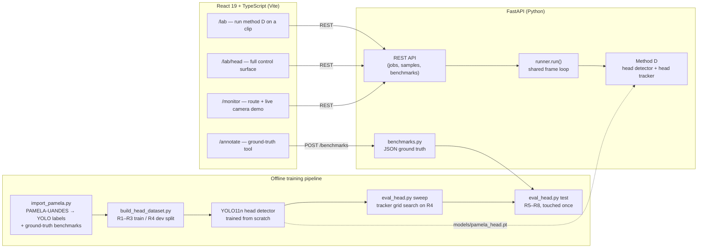
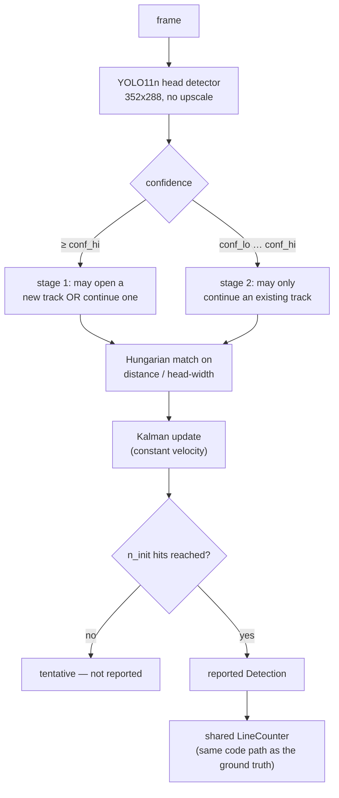
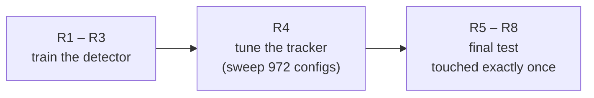

# CrowdLess

<p align="center">
  <a href="http://crowdless-demo.germanywestcentral.azurecontainer.io"><b>▶ Live demo</b></a>
  &nbsp;·&nbsp;
  <a href="#5-results">Results</a>
  &nbsp;·&nbsp;
  <a href="#9-getting-started">Run it locally</a>
</p>

**Computer-vision passenger counting for a dense doorway queue — a head detector trained on real annotated ground truth, a tracker built specifically for partial occlusion, and an evaluation protocol with a held-out test set that was touched exactly once.**

CrowdLess started as a simple operational question — *how full is this bus, right now?* — and turned into a small, honestly-measured research project on **how to count people crossing a doorway when they never stop overlapping each other**. An off-the-shelf "YOLO + tracker" pipeline collapses in exactly that scenario, because a whole-body detector and a box-based tracker both assume people are mostly separable — and in a boarding queue they are not. This repository documents what was tried, what failed and why, and the one approach that actually held up under a proper train/dev/test split.

<p align="center">
  
</p>

---

## Table of contents

1. [Motivation — why a dense queue breaks the obvious approach](#1-motivation--why-a-dense-queue-breaks-the-obvious-approach)
2. [System overview](#2-system-overview)
3. [Method D — head detector + head tracker](#3-method-d--head-detector--head-tracker)
4. [Data and the train / dev / test protocol](#4-data-and-the-train--dev--test-protocol)
5. [Results](#5-results)
6. [Ablation — what the custom tracker is actually buying](#6-ablation--what-the-custom-tracker-is-actually-buying)
7. [Limitations](#7-limitations)
8. [Other surfaces in the app](#8-other-surfaces-in-the-app)
9. [Getting started](#9-getting-started)
10. [Reproducing the pipeline from scratch](#10-reproducing-the-pipeline-from-scratch)
11. [Project structure](#11-project-structure)
12. [API reference](#12-api-reference)
13. [Internationalization](#13-internationalization)
14. [Tech stack](#14-tech-stack)
15. [Dataset citation and license](#15-dataset-citation-and-license)

---

## 1. Motivation — why a dense queue breaks the obvious approach

Automatic Passenger Counting (APC) is a mature commercial category — vendors like Hella Aglaia, Iris, Xovis and DILAX sell door-mounted sensors built on infrared, stereo depth or a proprietary vision stack. The obvious DIY approach — point an off-the-shelf person detector at the doorway camera, track the boxes, count line crossings — is what most tutorials online show, and it is what this project's own earlier iterations tried first: a stock YOLO + ByteTrack pipeline, a top-down pose model anchored to the shoulders, and classical background subtraction. All three were measured honestly against hand-annotated ground truth, and all three fell apart the moment the footage stopped being "one person walks through, alone" and became a **continuous, shoulder-to-shoulder boarding queue** — the realistic case, and the one every commercial APC system actually has to handle.

The diagnosis was consistent across all three approaches: from directly overhead, bodies in a queue visually merge into one mass. A whole-body detector either fuses two people into one box, or a background-subtraction blob fuses two people into one contour — either way, the count silently caps out at "how many separate masses do I see", which in a queue is usually 1.

The fix implemented here is method **D**: don't detect the body, detect the **head** — the part of a person that stays visually separate even when shoulders and torsos overlap — and pair it with a tracker designed around how a head actually moves and disappears in a crowd, not a generic multi-object tracker built for cars or spaced-out pedestrians. This is also what the literature converges on: the original PAMELA-UANDES paper (Velastin et al., 2020) built its own baseline around a head detector, and HeadHunter-T (Sundararaman et al., CVPR 2021) shows the same principle at CVPR-paper scale — in one of its own examples, a head detector finds 36 of 37 people in a crowd where a body detector finds 23.

## 2. System overview



**Backend** — a single FastAPI process (`backend/main.py`) exposes method D, the bundled sample clips, and the benchmark store. A one-worker thread pool serializes execution so reported frame rates are never distorted by concurrent jobs.

**Frontend** — a React 19 + TypeScript SPA. The `/lab` overview and `/lab/head` detail page share one state hook (`useLabSource`) for source selection, the counting line, and shared parameters.

**Training pipeline** — a standalone, backend-independent set of scripts (`backend/training/`) that import PAMELA-UANDES's real annotations, build the detector's training set, and tune/test the tracker with a protocol designed specifically to make overfitting to the test clips visible rather than silent.

## 3. Method D — head detector + head tracker

<p align="center">
  
</p>

*Four people simultaneously in frame, overlapping at the shoulders — each one still gets its own tracked head and its own trail. This is the exact scene that breaks a body-box tracker.*

### 3.1 The detector (`backend/counters/method_head.py`)

A **YOLO11n** detector trained from scratch on PAMELA-UANDES's real, hand-annotated head boxes (not a distilled/pseudo-labelled set — see [§4](#4-data-and-the-train--dev--test-protocol)). Frames are kept at their native 352×288: upscaling adds pixels, not information, and a head at this camera distance is already only ~32px wide.

### 3.2 The tracker (`HeadTracker` in the same file)

A generic multi-object tracker (ByteTrack, DeepSORT, BoT-SORT) is built around box IoU and a body-sized motion budget. Neither assumption holds for a small, fast-moving head, so this project implements its own:

- **Constant-velocity Kalman filter** per track — predicts where a head will be next frame and smooths measurement jitter, rather than trusting the raw detection centre.
- **Association by distance in head-widths, not IoU.** A ~32px head can move a large fraction of its own size between frames — exactly when a fast walker's box stops overlapping frame-to-frame under IoU matching. Distance normalised by head size stays stable through that.
- **Two-stage matching, the ByteTrack idea, applied to heads:** a confident detection may open a brand-new track *or* continue an existing one; a low-confidence detection — a head half-hidden behind a taller neighbour — may only **continue** a track, never start one. This is the single change that turned "shoulder-height occlusion" from a source of phantom double-counts into a track that simply survives.
- **Coasting through short occlusions.** An unmatched track keeps extrapolating (with decaying velocity) for up to `max_lost` frames before it is dropped, so a person briefly swallowed by the queue keeps their id and isn't recounted under a new one.
- **Track confirmation (`n_init`).** A track isn't reported — and can't be counted — until it has `n_init` consecutive hits, which filters out single-frame detector noise.



Output is the tracker's filtered head centre with a stable id, fed into the project's shared `CountLine`/`LineCounter` — the exact same code path used to turn PAMELA-UANDES's raw annotated tracks into the ground-truth numbers below, so the comparison isn't measuring two different pieces of counting logic.

## 4. Data and the train / dev / test protocol

**PAMELA-UANDES** (Velastin et al. 2020, *Sensors* 20(21):6251) is a research dataset of overhead doorway footage with every person's **head hand-annotated on every frame**, with a persistent id, across 15 videos of people boarding and alighting a train. That is real, dense ground truth — no distillation, no pseudo-labels.

The critical design decision is the split, because a tracker has knobs, and tuning those knobs on the same clips you report accuracy on produces a number that means nothing:



- **R1–R3** → the detector's only training data (`backend/training/build_head_dataset.py`).
- **R4** → held out from training; used to grid-search the tracker's five parameters (`backend/training/eval_head.py sweep`, 972 configurations scored by event F1).
- **R5–R8** → touched exactly once, after every other decision was already made (`eval_head.py test`).

Scoring follows the same convention as the PAMELA-UANDES paper's own Table 6: a predicted crossing is a true positive only if it matches a ground-truth crossing in the **same direction**, within **±1 second**; precision/recall/F1/accuracy (`accuracy = TP/(TP+FP+FN)`) are computed on those matches, not on raw counts.

## 5. Results

<p align="center">
  
</p>

Detector, on the held-out dev clip (R4, never trained on): **precision 0.98, recall 0.96, mAP50 0.991**.

End-to-end, on the test clips (R5–R8, 270 true entries, touched once):

| Metric | Value |
|---|---|
| IN mean absolute error | **0.57** entries/clip |
| OUT mean absolute error | 0.29 entries/clip |
| Event precision | 0.968 |
| Event recall | 0.975 |
| Event F1 | **0.972** |
| Event accuracy (TP / (TP+FP+FN)) | 0.945 |
| Inference speed | ~110–190 fps (Apple-Silicon MPS, no dedicated GPU) |

For scale: this project's earlier body-detector and background-subtraction methods, measured on the identical clips with the identical scoring, landed at **IN MAE 10.6–24** — an order of magnitude worse. (Those methods, and the code that produced that number, were dropped from the running app once D superseded them; see git history.)

Across all 8 benchmark segments this repository ships (including the older single fisheye clip from a different camera, see [§7](#7-limitations)):

```text
$ python -m backend.training.evaluate --suite
method    segments  MAE(in)    bias   exact  within1
head             8     1.12   -0.12     62%      75%
```

## 6. Ablation — what the custom tracker is actually buying

It would be easy to claim the hand-built `HeadTracker` is the reason this works. Measured honestly, it mostly isn't:

```text
$ python -m backend.training.eval_head trackers
bytetrack.yaml   IN MAE 0.71  OUT MAE 0.43  F1 0.972  acc 0.945
botsort.yaml     IN MAE 0.71  OUT MAE 0.43  F1 0.972  acc 0.945
```

The same detector, run under Ultralytics' stock ByteTrack or BoT-SORT instead of the custom tracker, gets the **same F1 (0.972)** and only a slightly worse count error (0.71 vs. 0.57 MAE). **Almost the entire improvement over the old methods comes from training a detector on real head labels — not from the tracker.** The custom tracker is a genuine, measured improvement, just a modest one on top of a much larger effect; presenting it as the whole story would be a materially misleading claim, so it isn't presented that way here.

## 7. Limitations

Stated plainly, because a portfolio project is more credible for saying this than for omitting it:

- **The detector does not transfer across cameras.** Run against the STONKAM fisheye bus-door benchmark (a different camera entirely — colour, 1920×1080, a different mounting height and lens), method D counts **0 of 5** true entries. Frame-by-frame inspection shows the detector *does* fire on real heads (confidence up to ~0.8) but flickers between roughly 0.1 and 0.8 on the same head across consecutive frames — it never sustains `n_init` (5) confident hits in a row, so no track is ever confirmed. This is a textbook domain-gap symptom, not a tracker bug: fixing it needs head labels from the target camera and a re-run of the same train/dev/test protocol, not a threshold tweak.
- **Only one dense-queue camera placement was used for training.** R1–R3 is PAMELA-UANDES's own camera at one height and angle; the detector's ceiling is that camera's own visual style.
- **The `--suite` MAE of 1.12** in [§5](#5-results) is pulled down by one dissimilar STONKAM clip method D was never meant for; the honest, in-domain number is the R5–R8 table above it.
- **Event matching tolerance (±1s) can mask small timing errors** that a stricter tolerance would surface — chosen to match the original paper's own protocol for comparability, not to flatter the result.

## 8. Other surfaces in the app

The counting research sits inside a small product shell — a ground-truth annotation tool, and a route planner + live-camera monitor for a simulated Kyzylorda (Kazakhstan) bus network — included so the counting pipeline has a plausible product context to be evaluated in. Bus positions and route occupancy on the map are **simulated**, not fed by live GPS.

<p align="center">
  
</p>

The `/annotate` page decodes a chosen segment into a frame-accurate strip (avoiding the seeking imprecision of a native `<video>` element under HTTP range requests), lets an annotator scrub it at up to quarter speed, and mark every entry/exit with a keystroke at the exact frame it happens. Saving writes a small JSON record under `benchmarks/` — a flat file, not a database, so a benchmark can be reviewed in a diff and committed alongside the code judged by it. Seven of the eight benchmarks shipped here are exactly this: PAMELA-UANDES's own annotated tracks, replayed through the app's own `CountLine`/`LineCounter`, so the ground truth is built by construction rather than eyeballed.

<p align="center">
  
</p>

**Per-bus door cameras.** On `/monitor`, selecting a bus and opening its *Camera* tab shows that bus's own door camera: the annotated frame, an activity chip (*Boarding* / *Alighting*), the Entered / Exited / Now counters and an occupancy bar. Each of the six camera slots replays real PAMELA-UANDES footage through method D (`backend/bus_cams.py`, served by `GET /bus-cam/{slot}`), and the selected bus on the map takes its numbers from the same camera.

- The counts are genuine detections on real footage, not an animation — only the bus positions and the starting occupancy of each bus are simulated.
- The dataset's clips film people walking in opposite directions across the line, so the playlists alternate *alighting* clips (`A_*`) with *boarding* clips (`B_No_*`). A bus therefore fills and empties instead of only ever filling, and the on-screen footage credit names the clip being shown.
- These clips are research-only (see [§15](#15-dataset-citation-and-license)) and are never bundled into the Docker image, so this feature needs a local `test_data/pamela-uandes/`. Without it, `/bus-cam` reports that no footage is available and the Camera tab falls back to the shared `/analyze` feed.

## 9. Getting started

### Prerequisites

- Python 3.11+ and Node.js 20+
- ~15 MB disk for the auto-downloaded YOLO11n base weights (fetched by `ultralytics` on first use)

### Backend

```bash
python3 -m venv .venv
source .venv/bin/activate
pip install -r backend/requirements.txt

uvicorn backend.main:app --reload --port 8000
```

`GET http://localhost:8000/health` should return `{"ok": true, "methods": ["head"], ...}`. The fine-tuned detector (`models/pamela_head.pt`, ~5 MB) is already committed — no training run is required to try the app.

### Frontend

```bash
npm install
cp .env.example .env   # fill in your own Google Maps key if you want the map view
npm run dev             # http://localhost:5173 (Vite picks the next free port if it's taken)
```

The lab (`/lab`) talks to the backend at a hardcoded `http://localhost:8000` (`src/services/counters.ts`) — keep the backend on that port, or edit the constant.

### Deployment

The app is containerised as two images — `Dockerfile.backend` (FastAPI + the CPU build of PyTorch/Ultralytics) and `Dockerfile.frontend` (the Vite build served by nginx, `nginx.conf`) — and `aci-deploy.yaml` describes them as one Azure Container Instances group (frontend on port 80, backend on 8000). A running instance is available at **http://crowdless-demo.germanywestcentral.azurecontainer.io**, and `GET :8000/health` on the same host reports `{"ok": true, "methods": ["head"], ...}`.

The deployed backend ships with a single bundled promo clip for the live feed. The PAMELA-UANDES dataset is deliberately **not** part of the image (restricted licence — see [§15](#15-dataset-citation-and-license)), which is why the per-bus cameras of [§8](#8-other-surfaces-in-the-app) only run locally.

### Data

`test_data/` is **not** included in this repository (see `.gitignore`) — it holds the PAMELA-UANDES dataset (restricted to registered research use — see [§15](#15-dataset-citation-and-license)) and vendor promotional clips. The app and every UI page work with an empty `test_data/`; drop your own `.mp4`/`.mov` clips in and they appear in the sample picker automatically. To reproduce the training pipeline you need PAMELA-UANDES itself — register at [videodatasets.org/PAMELA-UANDES](https://videodatasets.org/PAMELA-UANDES/whole_data.html) and extract it under `test_data/pamela-uandes/` (see `backend/training/import_pamela.py` for the exact expected file layout).

## 10. Reproducing the pipeline from scratch

```bash
# 1. Build the detector's training set (R1–R3 train / R4 dev) and the
#    ground-truth benchmarks (R5–R8, from PAMELA-UANDES's own annotated tracks)
python -m backend.training.build_head_dataset
python -m backend.training.import_pamela --skip-train   # writes benchmarks/*.json

# 2. Train the head detector from scratch
python3 -c "
from ultralytics import YOLO
YOLO('yolo11n.pt').train(data='datasets/pamela_head/data.yaml', imgsz=384,
                          epochs=30, batch=32, project='runs/head', name='y11n_384')
"
cp runs/head/y11n_384/weights/best.pt models/pamela_head.pt

# 3. Tune the tracker on R4 only, then test once on R5–R8
python -m backend.training.eval_head sweep
python -m backend.training.eval_head test

# 4. Honest ablation: how much of the result is the detector vs. the tracker
python -m backend.training.eval_head trackers

# 5. Score against every saved benchmark segment
python -m backend.training.evaluate --suite
```

### Comparison clip for the demo video

`backend/training/make_hook.py` renders a split-screen comparison on one annotated clip: a stock COCO YOLOv8n + ByteTrack counter on the left, method D on the right, both reading the same counting line, with a running ground-truth tally from the dataset's own annotations.

```bash
# Rank every benchmark clip first, so the clip you show is representative rather than the best one
python -m backend.training.make_hook --scan --scan-seconds 40 --stock-weights yolov8n.pt

# Render one comparison (--flip swaps which direction counts as IN/OUT)
python -m backend.training.make_hook --bench benchmarks/a-d800mm-r5_0.0-76.0.json \
    --start 14 --seconds 14 --stock-weights yolov8n.pt --flip --out out/hook.mp4
```

The stock detector looks for whole bodies, which a dense overhead doorway hides; on the clip above it counts 1 of 11 people leaving while method D counts 11. The scan shows the same gap on every clip, not just this one. Output goes to `out/` (git-ignored).

## 11. Project structure

```text
backend/
├── main.py                     FastAPI app — jobs, samples, benchmarks, live demo endpoint
├── bench.py                     CLI for a quick run of method D over a video file
├── benchmarks.py                Flat-file (JSON) ground-truth store
├── bus_cams.py                  Per-bus door cameras: real PAMELA clips replayed through method D
├── counters/
│   ├── runner.py                Shared frame loop + method D's parameter schema
│   ├── common.py                CountLine, LineCounter, CentroidTracker
│   └── method_head.py            Method D — YOLO11n head detector + HeadTracker
└── training/
    ├── import_pamela.py          PAMELA-UANDES CSVs → YOLO labels + ground-truth benchmarks
    ├── build_head_dataset.py     R1–R3 train / R4 dev split for the head detector
    ├── eval_head.py               sweep (tune on R4) / test (score on R5–R8) / trackers (ablation)
    └── make_hook.py               Split-screen stock YOLO + ByteTrack vs. method D comparison clip

src/
├── pages/
│   ├── LabPage.tsx               /lab — run method D on any bundled or uploaded clip
│   ├── MethodPage.tsx            /lab/head — full control surface for method D
│   ├── AnnotatePage.tsx          /annotate — ground-truth authoring tool
│   └── MonitorPage.tsx           /monitor — route planner + live camera demo
├── components/lab/               LinePreview, MethodCard (schema-driven controls)
├── hooks/useLabSource.ts         Shared source/line/params state (Lab ⇄ MethodPage)
├── i18n/                         ru.ts (source of truth) + en.ts
└── services/counters.ts          Typed client for the counting API

models/pamela_head.pt   The one fine-tuned deliverable (tracked, ~5 MB) — the real research output
benchmarks/             8 ground-truth segments (tracked, JSON) — 7 from PAMELA-UANDES, 1 legacy
docs/screenshots/       Images used in this README
```

## 12. API reference

| Endpoint | Purpose |
|---|---|
| `GET /methods` | Method D's metadata + its parameter schema, localized |
| `GET /models` | Weight-set variants per method (empty today — D ships one calibrated checkpoint) |
| `GET /samples` | Bundled clips with curated start-time / line presets |
| `GET /sample/{id}/thumb` | One JPEG frame, for placing the counting line |
| `GET /sample/{id}/strip` | Decoded frame sequence for the frame-accurate annotator |
| `POST /upload` · `POST /compare` | Analyse an uploaded video |
| `POST /sample/{id}/run` | Analyse a bundled clip without uploading |
| `GET /job/{id}` · `GET /job/{id}/video` | Poll a running job / download its annotated output |
| `GET|POST /benchmarks`, `DELETE /benchmarks/{id}` | Ground-truth CRUD used by the annotation tool |
| `GET /analyze` | Live-demo endpoint cycling through bundled clips (Monitor page) |
| `GET /bus-cam/{slot}` | One step of a per-bus door camera (slot 0–5): annotated frame, IN/OUT totals, occupancy, boarding/alighting activity. Needs the local dataset |
| `GET /health` | Liveness check — `{"ok": true, "methods": ["head"], ...}` |

## 13. Internationalization

The UI ships in Russian and English through a small React context (`src/i18n/`) rather than a heavyweight i18n library. Russian is the source of truth (every key must exist there); English is allowed to have gaps, falling back to Russian. The backend mirrors this for API-authored copy via a `lang` query parameter, so method D's description, pros/cons and dataset list are localized end-to-end.

## 14. Tech stack

**Frontend** — React 19, TypeScript, Vite, Tailwind CSS v4, Framer Motion, react-router-dom, react-leaflet / Leaflet, react-three-fiber + drei (the landing page's 3D globe).
**Backend** — FastAPI, Uvicorn, OpenCV, Ultralytics (YOLO11), PyTorch (CPU/CUDA/Apple-Silicon MPS auto-detected), `lap` (Hungarian assignment for the head tracker).
**Screenshots in this README** were captured headlessly (Playwright + Chromium) against the actual running application — every counted number you see is a real run, not a mock-up.

## 15. Dataset citation and license

This project's detector is trained on **PAMELA-UANDES**, which is restricted to registered, non-commercial research use. The raw dataset is not redistributed in this repository. Anyone reproducing the training pipeline must register their own access at [videodatasets.org/PAMELA-UANDES](https://videodatasets.org/PAMELA-UANDES/whole_data.html) and credit the original work:

> Velastin, S. A., Fernández, R., Espinosa, J. E., & Bay, A. (2020). Detecting, Tracking and Counting People Getting On/Off a Metropolitan Train Using a Standard Video Camera. *Sensors*, 20(21), 6251. https://doi.org/10.3390/s20216251

No license has been declared for this repository's own code yet; all rights reserved by default until one is added.
